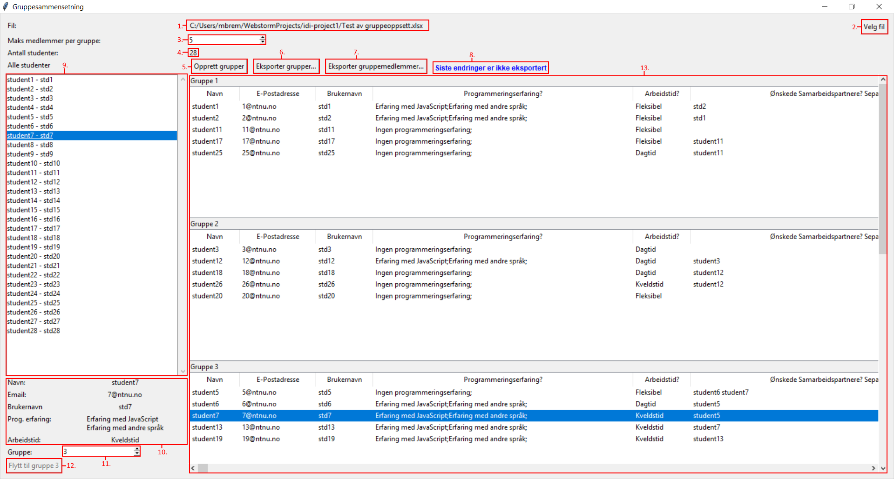

# Gruppesammensetning
  
Dette er et program for sammensetning av grupper til faget INFT1003 Webteknologi og Teamarbeid ved NTNU. 
Programmet tar et regneark med data om studentene, og et forslag til grupper, basert på at alle studentene skal få jobbe med sine ønskede samarbeidspartnere, at alle gruppene skal ha medlemmer med noe programmeringserfaring, og at så mange som mulig på gruppa kan jobbe på samme tid på dagen

## Innholdsfortegnelse
1. [Gruppesammensetning (topp)](#gruppesammensetning)
1. [Innholdsfortegnelse](#innholdsfortegnelse)
1. [Oversiktsbilde](#oversiktsbilde)
    1. [Bilde](#oversiktbilde)
    1. [Forklaring](#forklaring)
1. [Bruksanvisning](#bruksanvisning)
    1. [Last ned programmet](#1-last-ned-programmet)
    1. [Generer et Excel-ark med data](#2-generer-et-excel-ark-med-data)
    1. [Åpne programmet](#3-pne-programmet)
    1. [Importer dataene fra steg 2](#4-importer-dataene-fra-steg-2)
    1. [Opprett grupper](#5-opprett-grupper)
    1. [Flytte studenter](#6-flytte-studenter)
    1. [Eksportere grupper og gruppemedlemmer](#7-eksportere-grupper-og-gruppemedlemmer)
    1. [Importér grupper og gruppemedlemmer i BlackBoard](#8-importr-grupper-og-gruppemedlemmer-i-blackboard)
1. [Support](#support)
   
## Oversiktbilde

#### Forklaring
1. <ins>Filnavn til valgte fil</ins>
1. <ins>_Velg fil_-knapp</ins>  
    Trykk på denne for å velge en ny fil. Overskriver tidligere liste med studenter
1. <ins>Maksimum antall medlemmer i hver gruppe</ins>  
    Leses av programmet når knapp (5) - _Opprett grupper_ blir trykket på. Tallet bestemmer hvor mange studenter algoritmen lar det være i hver gruppe
1. <ins>Antall studenter funnet i den valgte filen</ins>
1. <ins>_Opprett grupper_-knapp</ins>  
    Oppretter et forslag til gruppesammensetning basert på ønskede samarbeidspartnere, programmeringserfaring og ønsket arbeidstid  
    Kun aktivert når en fil er valgt
1. <ins>_Eksporter grupper_-knapp</ins>  
    Åpner fildialog for å lagre liste over grupper i en .csv-fil  
    Kun aktivert når grupper har blitt opprettet
1. <ins>_Eksporter gruppemedlemmer_-knapp</ins>  
    Åpner fildialog for å lagre liste over gruppermedlemmer og -tilhørighet i en .csv-fil  
    Kun aktivert når grupper har blitt opprettet
1. <ins>Statusmeldinger for lagring av endringer</ins>  
    - __Siste endringer er ikke eksportert__  
        Det har blitt gjort en endring siden forrige eksport av data
    - __Grupper eksportert__  
        De siste endringene i antall grupper har blitt eksportert.  
        _NB: Det kan fortsatt være endringer i gruppemedlemskap som ikke er eksportert_
    - __Gruppemedlemmer eksportert__    
        De siste endringene i gruppemedlemskap har blitt eksportert.  
        _NB: Det kan fortsatt være endringer i antall grupper som ikke er eksportert_
    - __Eksport av grupper ble avbrutt__  
        En feil har oppstått og de siste endringene i antall grupper ble ikke eksportert.  
        Dette kan komme av at brukeren trykket på _Avbryt_, eller at fildialogen ble lukket uten å trykke på _Lagre_ 
    - __Eksport av gruppemedlemmer ble avbrutt__  
        En feil har oppstått og de siste endringene i gruppemedlemskap ble ikke eksportert.  
        Dette kan komme av at brukeren trykket på _Avbryt_, eller at fildialogen ble lukket uten å trykke på _Lagre_
1. <ins>Liste over studenter funnet i valgte fil</ins>  
    Hver linje i listen kan velges for å få mer informasjon om studenten i informasjonsfelt (10) og (11)
1. <ins>Informasjon om studenten</ins>  
    Her listes informasjonen hentet fra regnearket opp
1. <ins>Valgte students gruppemedlemskap</ins>  
    Når en student velges i listen (9) viser dette feltet hvilken gruppe studenten tilhører.  
    Ved å endre dette tallet, og deretter trykke på _Flytt_-knappen (12), kan du flytte en student til en annen gruppe
1. <ins>_Flytt student_-knapp</ins>  
    Knapp for å flytte en student til gruppen valgt i (11)  
    Kun aktiv om nummeret i (11) er annerledes enn nummeret på studentens gruppe
1. <ins>Liste over gruppemedlemskap</ins>  
    Her listes gruppene opprettet av programmet opp, med full oversikt over all informasjonen til hver student, for lett å kunne få oversikt over hvilke egenskaper hver student i gruppen har.  
    Hver rad kan klikkes på for å velge studenten i listen (9) og få informasjonen i informasjonsfeltene (10) og (11)
    
## Bruksanvisning
#### 1. Last ned programmet
Last ned den relevante filen for ditt system, og lagre den på et fornuftig sted:
* Windows: [Gruppesammensetning_win.exe](./dist/Gruppesammensetning_win.exe)
* ~~Mac: Fungerer ikke.~~  [Gruppesammensetning_mac.app](./dist/Gruppesammensetning_mac.zip)

#### 2. Generer et Excel-ark med data
For å kunne generere grupper, trenger du et regneark på formatet:

| ID  | Starttidspunkt | Fullføringstidspunkt | E-postadresse      | Navn       | Brukernavn | Programmeringserfaring        | Ønsket arbeidstid | Ønskede samarbeidspartnere |
|-----|----------------|----------------------|--------------------|------------|------------|-------------------------------|-------------------|----------------------------|
| 1   | Tid            | Tid                  | stud1@stud.ntnu.no | student1   | stud1      | Erfaring med JavaScript;      | Dagtid            | student2                   |
| 2   | Tid            | Tid                  | stud2@stud.ntnu.no | student2   | stud2      | Erfaring med andre språk;     | Kveldstid         |                            |
| 3   | Tid            | Tid                  | stud3@stud.ntnu.no | student3   | stud3      | Ingen programmeringserfaring; | Fleksibel         |                            |
| 4   | Tid            | Tid                  | stud4@stud.ntnu.no | student4   | stud4      | Følger JavaScript-kurs;       | Dagtid            |                            | 
| N/A | N/A            | N/A                  | **VIKTIG**         | **VIKTIG** | **VIKTIG** | **VIKTIG**                    | **VIKTIG**        | Frivillig                  |

Den kan genereres ved å la studentene svare på [dette spørreskjemaet](https://forms.office.com/Pages/ShareFormPage.aspx?id=cgahCS-CZ0SluluzdZZ8BVIwJWvqz_9Crtj1AnKbJ95UMDFaVjYwQkxDVzdZVUlYNERJRzZRNjlKSy4u&sharetoken=z0NOzokK5c78FgHYXRT3). For å få tak i en kopi av spørreskjemaet for å sende til studentene, må du:
1. Trykke på linken til [dette spørreskjemaet](https://forms.office.com/Pages/ShareFormPage.aspx?id=cgahCS-CZ0SluluzdZZ8BVIwJWvqz_9Crtj1AnKbJ95UMDFaVjYwQkxDVzdZVUlYNERJRzZRNjlKSy4u&sharetoken=z0NOzokK5c78FgHYXRT3) for å åpne det i en ny fane.
2. Trykk på _Dupliser det_  
Du vil nå få en kopi av skjemaet koblet til din Microsoft-konto
3. Endre navn og beskrivelse på skjemaet om nødvendig.  
**NB - Ikke endre på svaralternativene eller rekkefølgen på spørsmålene. Da vil ikke programmet fungere**
4. Klikk på _Del_, kopiér linken under _Send og samle inn svar_, og send til studentene. Pass på at **<ins>alle</ins>** studentene svarer på undersøkelsen
5. Etter at alle studentene har svart trykker du på _Svar_ og _Åpne i Excel_. Da vil du laste ned en Excel-fil du kan bruke i programmet

#### 3. Åpne programmet
Finn fram til der du lagret [main.exe](./dist/Gruppesammensetning.exe) og dobbeltklikk på filen

#### 4. Importer dataene fra steg 2
Klikk på knappen _Velg fil_  
Naviger til der du lagret Excel-filen med studentenes svar  
Klikk på filen, og deretter _Åpne_, eller dobbeltklikk på filen  
En liste med alle studentenes navn og e-postadresse skal dukke opp på venstre side, og _Antall studenter_ skal reflektere hvor mange studenter det er i lista  

#### 5. Opprett grupper
Klikk på knappen _Opprett grupper_  
En liste med grupper og informasjon om studentene i hver gruppe skal komme nede på høyre side

#### 6. Flytte studenter
Hvis du ikke er fornøyd med gruppene programmet har satt opp, kan du velge en student fra listen til venstre eller i gruppelisten, endre tallet i boksen markert _Gruppe:_, og trykke på _Flytt til gruppe X_

#### 7. Eksportere grupper og gruppemedlemmer
Når du er fornøyd med gruppene, kan du eksportere grupper og gruppemedlemmer ved å trykke på knappene _Eksporter grupper..._ og _Eksporter gruppemedlemmer..._
Siden BlackBoard importerer grupper og gruppemedlemmer separat, må det også eksporteres som to filer.
Velg filplassering og navn på filene (standard er _Grupper.csv_ og _Gruppemedlemmer.csv_)

#### 8. Importér grupper og gruppemedlemmer i BlackBoard
For å importere grupper og gruppemedlemmer går du til fagrommet til faget ditt i BlackBoard.
Under _Emnebehandling_ på venstre side velger du _Brukere og grupper_ og trykker på _Grupper_.  
Trykk på _Importer_  
Under _IMPORTER GRUPPEMEDLEMMER_ trykker du på _Bla gjennom min datamaskin_, navigerer til der du lagret de eksporterte filene, og velger filen som inneholder Gruppemedlemmene, standard navn er _Gruppemedlemmer.csv_  
Under _IMPORTER GRUPPER_ gjør du det samme, men velger filen med gruppene istedenfor, standard navn er _Grupper.csv_  
Velg hvilke verktøy gruppene skal ha tilgang til, og trykk _Send_  
BlackBoard er litt tregt, så om du ikke ser gruppene med én gang skal det bare være å vente litt og så laste inn siden på nytt med F5 eller Ctrl+R  
Hvis du ikke har endret innstillingene dine for mailing i BlackBoard skal du også få en mail når gruppene er importert

Nå skal gruppene være importert i BlackBoard. Sjekk om alle studentene er i en gruppe, og legg inn de som mangler

### Support
Ved eventuelle bugs eller problemer med programmet kan jeg kontaktes på [magbre@ntnu.no](mailto:magbre@ntnu.no?subject=Gruppesammensetning)